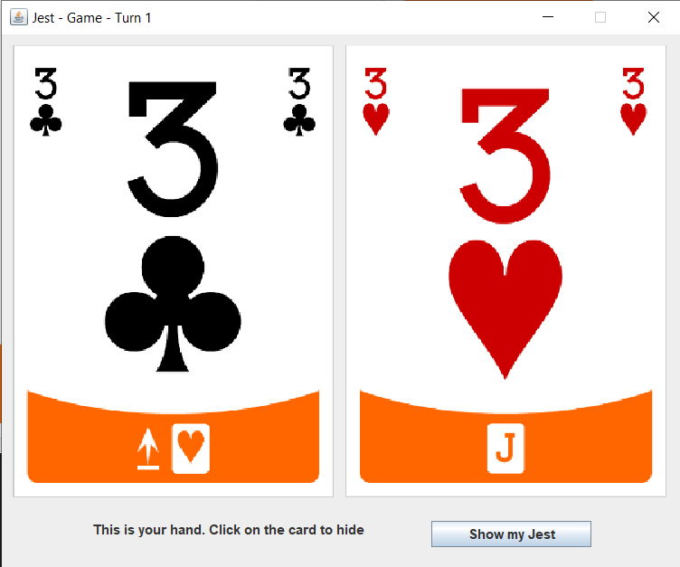
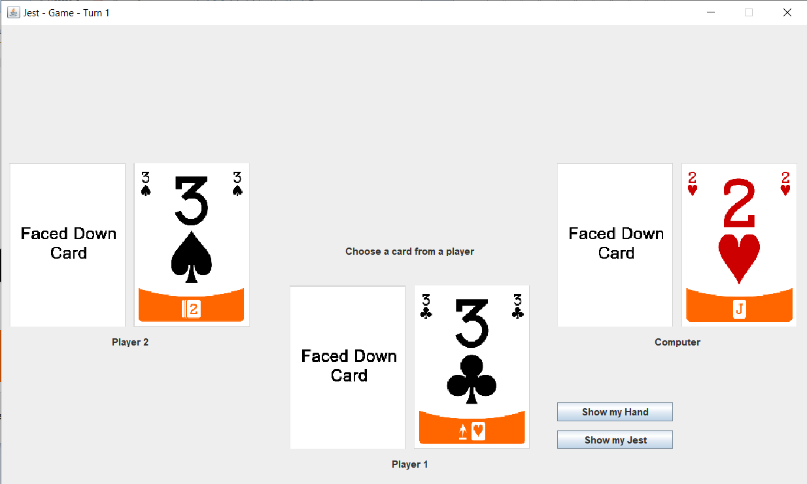

# Java MVC card game

This is a card game adapted in Java in 2019.
Initially built with Eclipse, this used JDK 13.0.2.

## Repository content

- /doc : project documentation. Open index.html to navigate
- /src : source code in Java
- /bin and /class : compiled classes
- /dist : jar file to execute to play the game
- class_diagram.jpg : class diagram of the project. This includes some comments in french : "notifie" means "notifies", "méthodes" means "methods" and we specify that equals, getters, setters and constructors methods are not written.

## Screenshots

